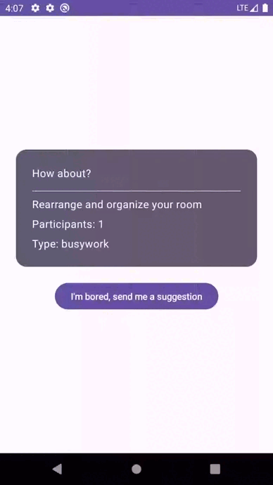

# BoredAPP consuming API with Ktor

## Objective
This application aims to demonstrate how to consume an API using the Ktor framework in an Android application. Through this example, you will learn how to configure an HTTP client, make requests to the API, and handle the received responses.

## Preview

## Prerequisites
- Basic knowledge of Kotlin.
- Installed Android Studio.
- Configured development environment.

## App Features
- Configuration of an HTTP client using the Ktor framework.
- Consumption of an external API to fetch data.
- Display of the fetched data in the user interface.

## Resources Used
- Ktor framework for configuring the HTTP client.
- Android Studio for Android app development.
- Kotlin as the programming language.
- Jetpack Compose for creating the user interface.
- Koin for dependency injection.

## App Flow
1. The application starts and makes an HTTP request using the configured Ktor client.
2. The API returns the requested data.
3. The data is processed and displayed in the user interface.

## Conclusion
This example app demonstrates how easy and powerful it is to use the Ktor framework to consume APIs in Android applications. With simple configuration, you can make HTTP requests and efficiently handle responses, making app development faster and more effective.

## Additional Resources
- [Ktor Official Documentation](https://ktor.io/docs/client-dependencies.html#plugin-dependency)
- [Koin Official Documentation](https://insert-koin.io/docs/quickstart/android/)
- [Jetpack Compose Toolkit Documentation](https://developer.android.com/jetpack/compose)
